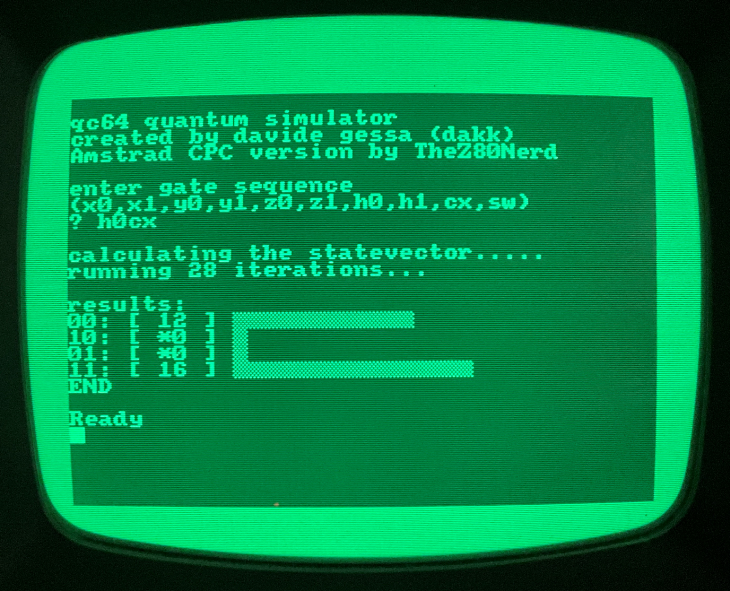

# QCPC - Quantum Simulator for the Amstrad CPC

QCPC is an experimental quantum computing simulator for the Amstrad CPC, written in pure BASIC.
Ported and tested on a real Amstrad CPC 464 with 64K RAM and a fancy green monitor.
This is a port of qc64 project by Davide Gessa (dakk) https://github.com/dakk/qc64

## Features

-    Simulate operations of various quantum gates including Pauli-X, Pauli-Y, Pauli-Z, Hadamard, CNOT, and SWAP on a two-qubit system.
-    Written in less than 200 lines of BASIC code.

## How it works

Starting from the initial state |00>, the simulator can apply various quantum gates to manipulate the state of the two-qubit system. This allows for the simulation of various quantum computing concepts right on your Amstrad CPC!

## Contributions

Contributions to QCPC are welcome! Feel free to create a pull request or open an issue if you have ideas for improvements or spot any bugs.

## License

QCPC is released under MIT License.
Let's Rekindle the Magic of Vintage Computing!
